## Préparé par
AFIF Ikram

AIT ALLA Hajar
# Rapport de TP1 – Simulation du potentiel électrostatique par méthode DF
## 1. Introduction

Dans le domaine de la compatibilité électromagnétique (CEM), la détermination du potentiel électrostatique est essentielle pour comprendre l’influence de structures conductrices sur leur environnement. Lorsque la géométrie devient complexe, la résolution analytique de l’équation de Laplace n’est plus envisageable. On utilise alors des méthodes numériques comme celle des différences finies (DF).

L’équation de Laplace dans un domaine sans charge s’écrit : ΔV=0

En discrétisant le domaine en une grille 2D, et avec un pas uniforme dx=dy=1, cette équation devient :

  **𝑉𝑖,𝑗=1/4(𝑉𝑖+1,𝑗+𝑉𝑖−1,𝑗+𝑉𝑖,𝑗+1+𝑉𝑖,𝑗−1)**

Le but du TP est d’appliquer cette méthode DF dans un code Matlab pour résoudre le potentiel 𝑉(x,y) autour de deux conducteurs rectangulaires placés dans un domaine carré. On y ajoutera une étude du champ électrostatique, des lignes équipotentielles, ainsi qu’un calcul de capacité.

## 2. Objectifs pédagogiques

Ce TP a pour objectifs :

-D’appliquer la méthode des différences finies à la résolution de l’équation de Laplace.

-D’implémenter un schéma de résolution numérique en environnement Matlab.

-D’observer la distribution du potentiel V(x,y) dans un domaine contenant deux conducteurs.

-De visualiser les lignes équipotentielles et le champ électrique.

-D’analyser la convergence et l’influence du domaine sur le résultat physique.

## 3. Étape 1 – Initialisation du domaine (tp01.m)

Dans cette étape, on exécute le script tp01.m, qui prépare le domaine 2D (40×40 points), initialise les conditions aux limites et applique les potentiels de chaque conducteur.
V=0 sur tout le bord (approximation du potentiel à l’infini).

Deux barres rectangulaires : Conducteur 1 et conducteur 2 
Le reste du domaine est initialisé à 0.

**Figure : Visualisation du potentiel initial avec les deux conducteurs fixés**

Cette figure montre simplement l’état initial du domaine avant propagation du potentiel via les équations. Elle ne représente pas encore la physique du problème (pas de solution de Laplace), mais elle prépare le champ de calcul pour les étapes suivantes.

## 4. Étape 2 – Calcul du potentiel par 200 itérations (tp02.m)

L’objectif ici est de résoudre l’équation de Laplace de manière numérique à l’aide de la méthode des différences finies. On applique la formule d’itération :
**𝑉𝑖,𝑗=1/4(𝑉𝑖+1,𝑗+𝑉𝑖−1,𝑗+𝑉𝑖,𝑗+1+𝑉𝑖,𝑗−1)**

Le calcul est appliqué 200 fois sur l’ensemble du domaine, sauf sur les zones des conducteurs où le potentiel reste fixé.

**Figure – Potentiel après 200 itérations**

Après 200 itérations, le potentiel s’est réparti harmonieusement dans le domaine. On observe une transition progressive entre les deux conducteurs : le potentiel diminue du centre rouge vers la zone bleue, traduisant la présence d’un champ électrique bien orienté. Les conditions aux limites sont respectées, et le résultat confirme que l’algorithme de relaxation s’approche d’un état stationnaire.

## 5. Étape 3 – Ajout d’un critère de convergence (tp03.m)
Plutôt que de fixer un nombre d’itérations arbitraire, on introduit un critère d’arrêt basé sur la variation maximale du potentiel entre deux itérations successives. Le calcul s’arrête lorsque cette variation devient inférieure à un seuil donné.
**Figure – Potentiel avec arrêt à epsilon = 0.01**

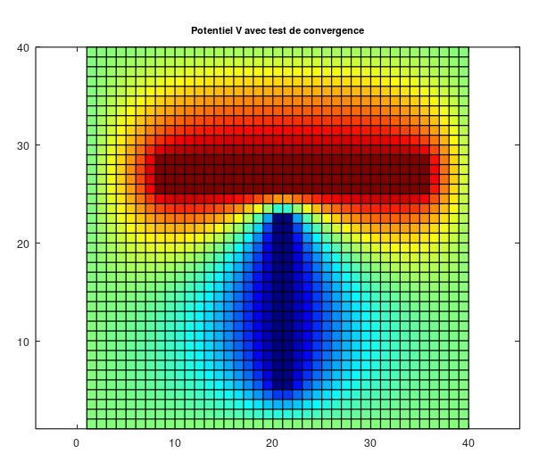

L’utilisation d’un critère de convergence rend l’algorithme plus précis et adaptatif : le calcul s’arrête automatiquement dès que le potentiel devient stable. Un seuil plus strict entraîne un plus grand nombre d’itérations, mais ne modifie pas significativement la forme du potentiel – seulement sa précision numérique. La solution reste visuellement très proche de celle obtenue avec 200 itérations.

## 6. Étape 4 – Influence de la taille du domaine (tp04.m)

Cette étape explore l’effet de la taille du domaine (valeurs de Nx et Ny) sur la solution obtenue. Un domaine plus large éloigne les bords à potentiel nul, ce qui simule mieux des conditions « à l’infini ».
Nous avons agrandi le domaine (par exemple Nx = 60, Ny = 60) en conservant la même position relative des conducteurs.

**Figure – Potentiel dans un domaine élargi**

Quand le domaine est plus grand, les conducteurs sont plus éloignés des bords à 0 V, ce qui diminue leur influence. Le champ et le potentiel ont plus d’espace pour s’étendre naturellement, ce qui se rapproche mieux de la réalité physique. À l’inverse, un petit domaine fausse les résultats en comprimant les lignes de champ.

## 7. Étape 5 – Lignes équipotentielles (tp05.m)

Nous avons tracé les lignes équipotentielles à l’aide de la fonction contour, qui permet de visualiser les zones à potentiel constant.
**Figure – Lignes équipotentielles**

Les lignes équipotentielles sont perpendiculaires au champ électrique. Elles montrent comment le potentiel évolue entre les deux conducteurs. Plus elles sont rapprochées, plus le champ est intense. C’est un outil précieux pour visualiser le comportement du système.

## 8. Étape 6 – Champ électrique (tp06.m)

On calcule le champ électrique à partir du gradient du potentiel, les composantes du champ sont extraites via la fonction gradient, puis affichées avec quiver.

**Figure – Champ électrique (vecteurs)**

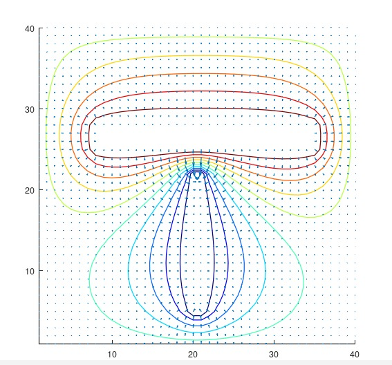

Le champ électrique est bien dirigé du conducteur positif vers le négatif. Les vecteurs sont plus denses et plus longs près des conducteurs (champ intense), et s’éloignent à mesure qu’on s’écarte. La distribution est cohérente avec la physique attendue d’un champ électrostatique.
## Étape 7 – Calcul de la capacité (tp07.m)

Dans cette dernière étape, on utilise le champ électrique E=−∇V pour estimer la charge totale Q entourant le conducteur à +100 V, puis on calcule la capacité selon :  C = Q/U

## 9. Conclusion 

Ce TP a permis de simuler la répartition du potentiel électrostatique dans un domaine 2D à l’aide de la méthode des différences finies. La solution obtenue est cohérente avec la physique attendue, montrant un champ électrique dirigé du conducteur positif vers le conducteur négatif. L’utilisation d’un critère de convergence, l’analyse des lignes équipotentielles et le calcul de la capacité ont permis de valider la méthode numérique et de mieux comprendre le comportement des systèmes électrostatiques.

# Rapport de TP2 – Utilisation de la méthode DF pour la simulation CEM
## Exercice 1 – Algorithme FDTD (Implémentation Matlab)

Le script scriptFDTD01 met en œuvre la méthode FDTD (Finite Difference Time Domain) afin de modéliser la propagation d’une onde électromagnétique unidimensionnelle dans le vide. Le domaine spatial est discrétisé en 201 points, tandis que la simulation temporelle est réalisée sur 100 pas de temps, avec un pas temporel choisi de manière à respecter le critère de stabilité de la méthode.

À chaque itération temporelle, le champ électrique E est d’abord calculé à partir des différences spatiales du champ magnétique H. Une source de type hard, de forme gaussienne, est ensuite appliquée au centre du domaine afin d’exciter l’onde électromagnétique. Le champ magnétique H est ensuite mis à jour à partir des variations spatiales du champ électrique.

Les champs E et H évoluent ainsi selon le schéma classique de la méthode FDTD, sans conservation des valeurs intermédiaires. Le script permet de visualiser en temps réel la propagation de l’onde à travers l’affichage du champ électrique E à chaque itération, puis présente les distributions finales des champs électrique et magnétique à la fin de la simulation.

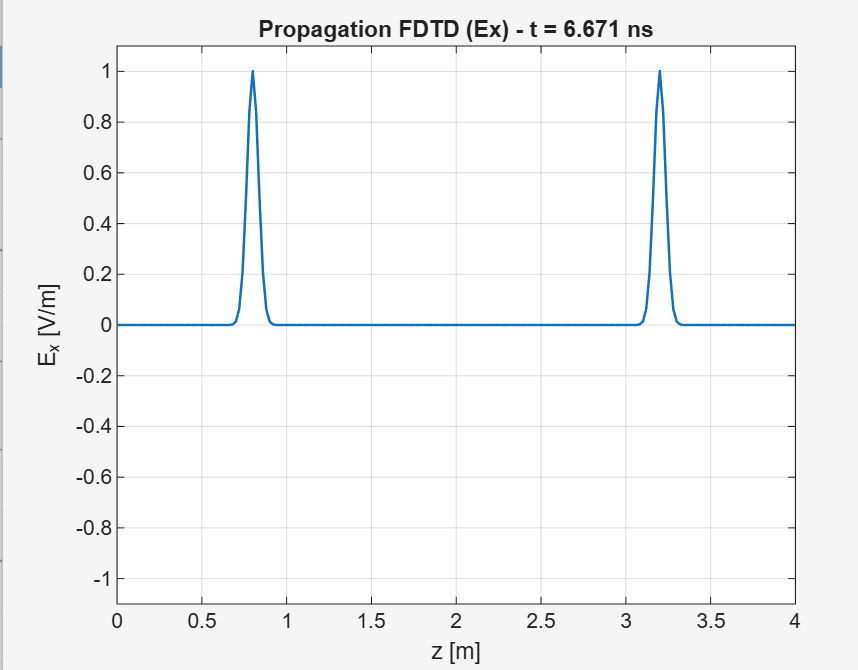 
 
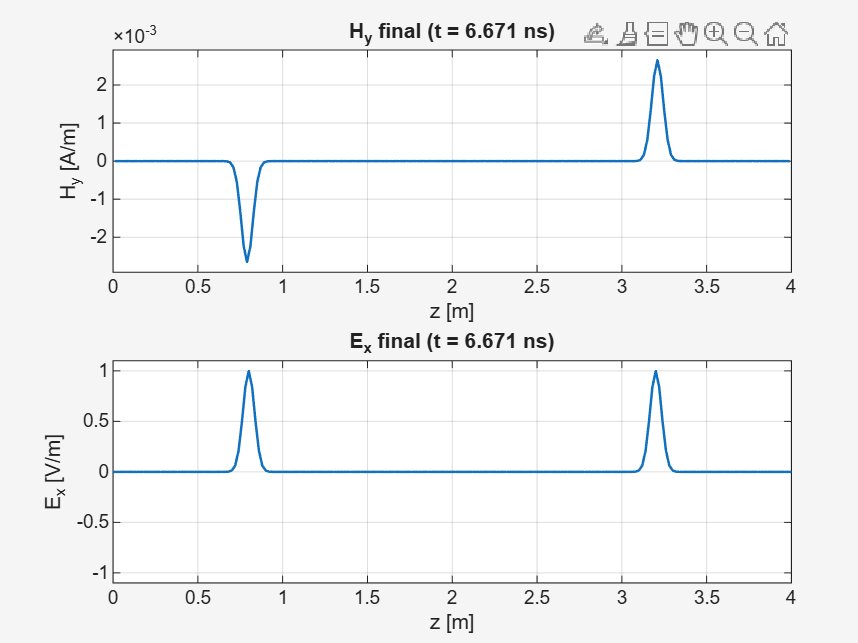

 ## Exercice 2 – Test de la condition de stabilité
 Dans cette partie, la longueur du domaine de simulation est doublée afin de limiter les effets de bord et d’éviter les réflexions aux extrémités du segment.

Pour α = 0.5 et un domaine doublé (L = 4), le schéma FDTD demeure stable, car le critère de stabilité est largement respecté. Cependant, on constate une dispersion numérique plus importante : le pulse gaussien se déforme progressivement au cours de la propagation. Cette déformation s’explique par un pas de temps trop faible, qui accentue les erreurs de dispersion inhérentes au schéma FDTD.

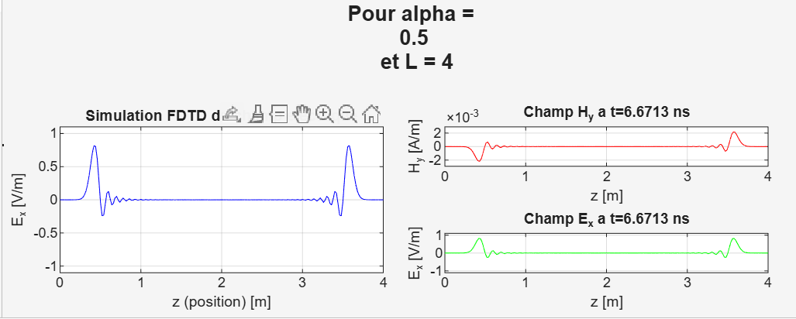
 
 Pour alpha = 1.1 et avec L doublé (L = 4) :
 
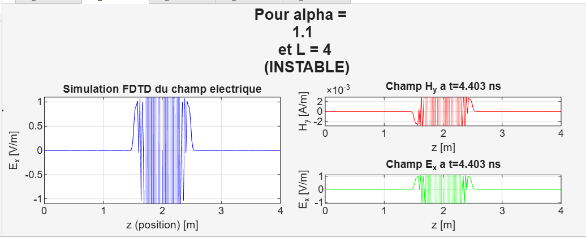
 
 Pour alpha = 1.01 et avec L doublé (L = 4) :
 
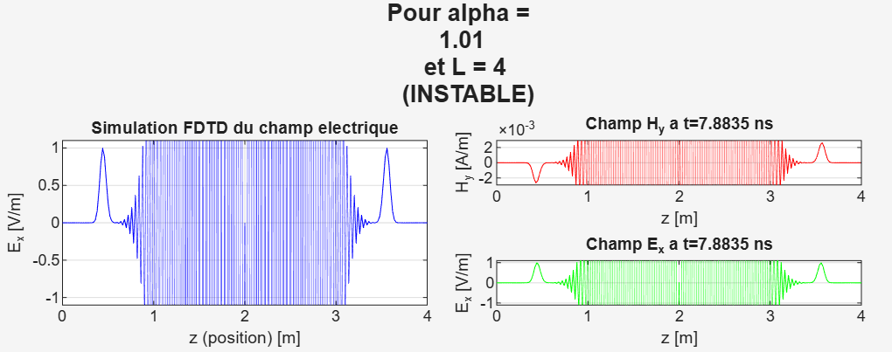
 
 À l’inverse, dès que α dépasse 1 (α = 1.01 ou 1.1), la simulation devient instable : les champs divergent rapidement
 et des oscillations non physiques apparaissent.
 
 Pour alpha = 0.95 et avec L doublé (L = 4) :
 
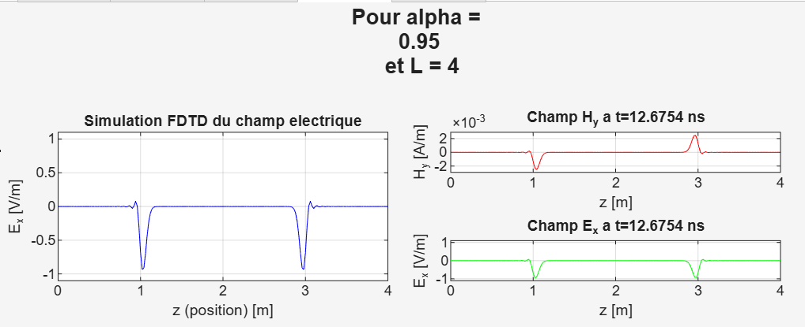

 Pour alpha = 0.99 et avec L doublé (L = 4) :
 
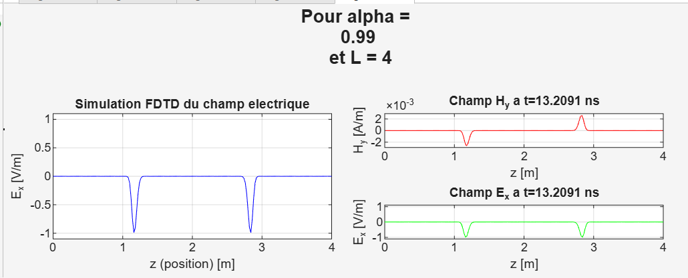
  
---
# Rapport du TP3 : Modélisation de Cavités Résonantes avec FDTD

Cette partie sert de compte-rendu pour le TP3 sur la sensibilisation à la simulation électromagnétique (CEM) et la modélisation de cavités résonantes avec la méthode FDTD (Différences Finies dans le Domaine Temporel).

## 1. Objectifs du TP

Les principaux objectifs de ce travail pratique étaient :
- Évaluer numériquement les fréquences de résonance d'une cavité parallélépipédique.
- Modéliser le comportement d'une cavité réverbérante via un code FDTD 3D.
- Comprendre l'influence d'un matériau diélectrique sur les modes de résonance.

## 2. Structure du Projet

Le projet est organisé autour de plusieurs scripts `.m` situés dans le répertoire `TP3_solution/` :

- **Calcul Analytique :**
  - `tp00.m` : Calcule les fréquences de résonance théoriques.
- **Simulations FDTD :**
  - `FDTD_crbm_vide.m` : Simule une cavité vide.
  - `FDTD_crbm_chargee.m` : Simule une cavité chargée avec un diélectrique.
  - `tp06.m` : Lance les deux simulations FDTD.
- **Analyse Temporelle :**
  - `tp07.m` : Visualise les résultats temporels pour chaque simulation séparément.
  - `tp07_comparaison.m` : Superpose et compare les résultats temporels.
- **Analyse Fréquentielle :**
  - `FFT_crbm_modified.m` : Fonction pour réaliser la Transformée de Fourier Rapide.
  - `tp08.m` : Script qui appelle la fonction FFT.
  - `tp09.m` : Visualise et analyse les spectres en fréquence.

## 3. Déroulement et Résultats

### Étape 1 : Calcul Analytique des Fréquences de Résonance

La première étape consistait à calculer les fréquences de résonance théoriques d'une cavité de dimensions a=6.7m, b=8.4m, d=3.5m à l'aide de la formule :
`f_mnp = (c/2) * sqrt((m/a)^2 + (n/b)^2 + (p/d)^2)`

Le script `tp00.m` a été créé à cet effet.

**Résultats obtenus :**

Les 10 premiers modes de résonance viables (m, n, p, fréquence en Hz) :

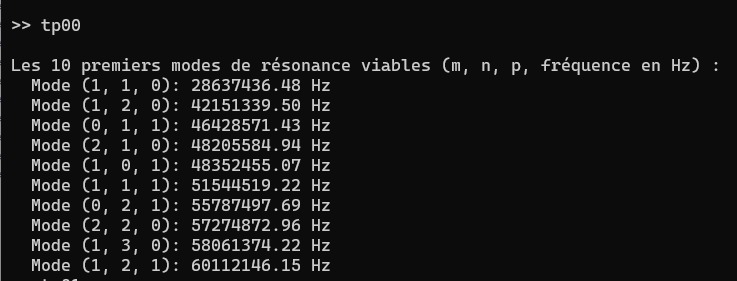

### Étape 2 : Simulation FDTD

Deux simulations ont été réalisées en utilisant la méthode FDTD sur 400 itérations temporelles :
1.  **Cavité Vide :** Simule la cavité remplie d'air (vide). Les résultats sont sauvegardés dans `result_vide.txt`.
   

   
2.  **Cavité Chargée :** Simule la même cavité avec un bloc diélectrique (εr = 3) à l'intérieur. Les résultats sont sauvegardés dans `result_chargee.txt`.
   
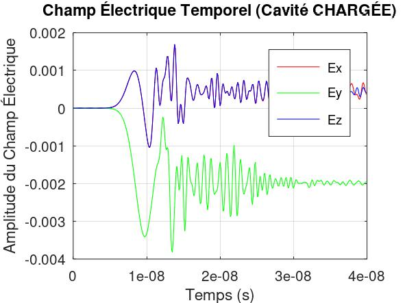

Le script `tp06.m` a été utilisé pour lancer ces deux simulations.

### Étape 3 : Analyse Temporelle

Les résultats temporels des champs électriques (Ex, Ey, Ez) au point d'observation ont été visualisés. Bien que les graphiques des deux simulations apparaissent similaires au premier abord, une analyse comparative (`tp07_comparaison.m`) a révélé des différences subtiles dans la phase et l'amplitude des ondes après l'arrivée de l'impulsion initiale, confirmant que le diélectrique a une influence sur la propagation des ondes.
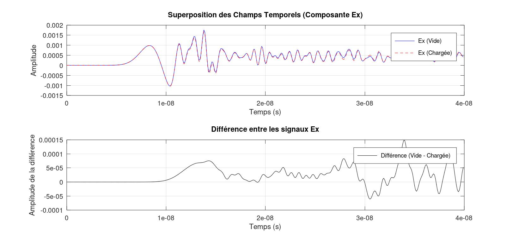

### Étape 4 : Analyse Fréquentielle 

L'analyse FFT a été réalisée sur les données temporelles pour obtenir les spectres en fréquence.

**Analyse des résultats :**

À partir du spectre fréquentiel complet, on observe que la cavité vide présente un pic de résonance principal à basse fréquence, autour de 60 MHz.

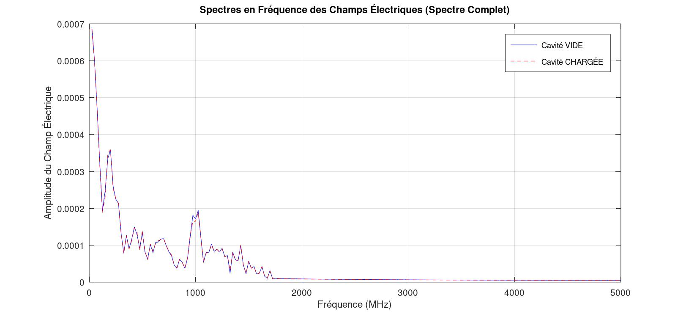

Pour la cavité chargée, ce pic est légèrement décalé vers une fréquence plus basse, autour de 50–55 MHz. Les résonances secondaires présentent le même comportement.

Ce décalage vers les basses fréquences est dû à la présence du diélectrique, qui augmente la permittivité effective de la cavité et diminue ainsi ses fréquences de résonance.

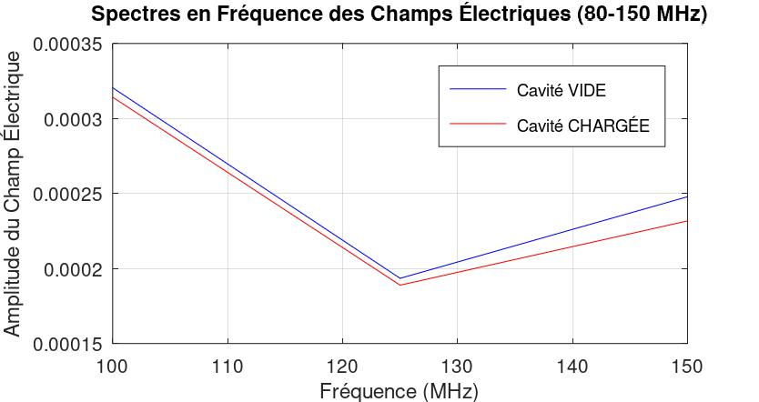

La plage [80MHz, 150MHz] demandée dans le TP correspond à un minimum spectral et ne contient donc pas de résonances majeures pour cette configuration.

### Conclusion

Ce travail pratique a permis de mettre en œuvre une chaîne complète de simulation électromagnétique pour l'analyse d'une cavité résonante. En
partant du calcul analytique des modes de résonance, nous avons utilisé un code FDTD pour simuler le comportement temporel d'une cavité, d'abord vide, puis chargée par un diélectrique.

L'analyse des résultats a mis en évidence plusieurs points clés :
   - La méthode FDTD est un outil puissant qui permet d'obtenir une réponse large bande à partir d'une unique simulation temporelle.
   - La Transformée de Fourier (FFT) est essentielle pour passer du domaine temporel au domaine fréquentiel afin d'identifier les fréquences de résonance.
   - L'influence d'un matériau diélectrique a été clairement démontrée : les résultats de la simulation confirment la théorie, qui prédit un décalage des fréquences de résonance vers des valeurs plus basses en raison de l'augmentation de la permittivité effective de la cavité.

