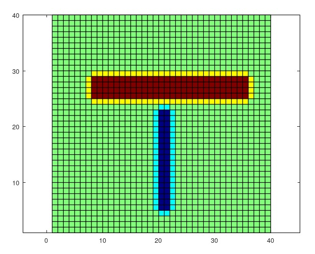
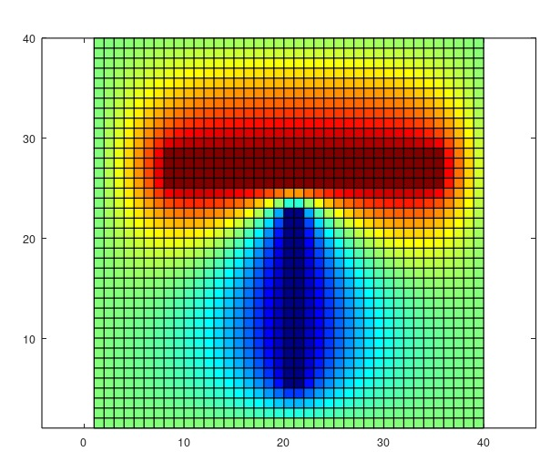
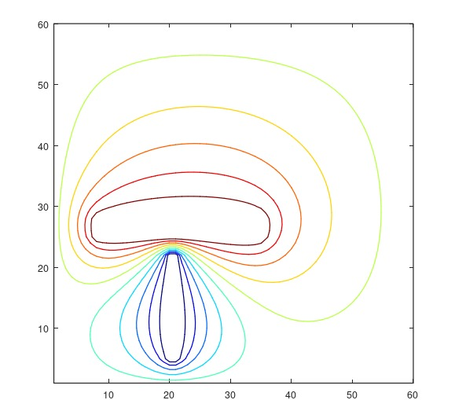
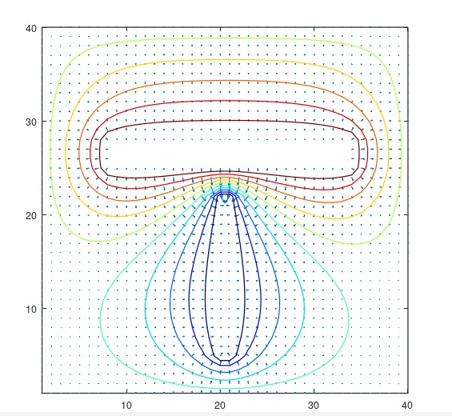

# Rapport de TP – Simulation du potentiel électrostatique par méthode DF
## 1. Introduction

Dans le domaine de la compatibilité électromagnétique (CEM), la détermination du potentiel électrostatique est essentielle pour comprendre l’influence de structures conductrices sur leur environnement. Lorsque la géométrie devient complexe, la résolution analytique de l’équation de Laplace n’est plus envisageable. On utilise alors des méthodes numériques comme celle des différences finies (DF).

L’équation de Laplace dans un domaine sans charge s’écrit : ΔV=0

En discrétisant le domaine en une grille 2D, et avec un pas uniforme dx=dy=1, cette équation devient :

  **𝑉𝑖,𝑗=1/4(𝑉𝑖+1,𝑗+𝑉𝑖−1,𝑗+𝑉𝑖,𝑗+1+𝑉𝑖,𝑗−1)**

Le but du TP est d’appliquer cette méthode DF dans un code Matlab pour résoudre le potentiel 𝑉(x,y) autour de deux conducteurs rectangulaires placés dans un domaine carré. On y ajoutera une étude du champ électrostatique, des lignes équipotentielles, ainsi qu’un calcul de capacité.

## 2. Objectifs pédagogiques

Ce TP a pour objectifs :

-D’appliquer la méthode des différences finies à la résolution de l’équation de Laplace.
-D’implémenter un schéma de résolution numérique en environnement Matlab.
-D’observer la distribution du potentiel V(x,y) dans un domaine contenant deux conducteurs.
-De visualiser les lignes équipotentielles et le champ électrique.
-D’analyser la convergence et l’influence du domaine sur le résultat physique.

## 3. Étape 1 – Initialisation du domaine (tp01.m)

Dans cette étape, on exécute le script tp01.m, qui prépare le domaine 2D (40×40 points), initialise les conditions aux limites et applique les potentiels de chaque conducteur.
V=0 sur tout le bord (approximation du potentiel à l’infini).

Deux barres rectangulaires : Conducteur 1 et conducteur 2 
Le reste du domaine est initialisé à 0.

**Figure : Visualisation du potentiel initial avec les deux conducteurs fixés**

Cette figure montre simplement l’état initial du domaine avant propagation du potentiel via les équations. Elle ne représente pas encore la physique du problème (pas de solution de Laplace), mais elle prépare le champ de calcul pour les étapes suivantes.

## 4. Étape 2 – Calcul du potentiel par 200 itérations (tp02.m)

L’objectif ici est de résoudre l’équation de Laplace de manière numérique à l’aide de la méthode des différences finies. On applique la formule d’itération :
**𝑉𝑖,𝑗=1/4(𝑉𝑖+1,𝑗+𝑉𝑖−1,𝑗+𝑉𝑖,𝑗+1+𝑉𝑖,𝑗−1)**
Le calcul est appliqué 200 fois sur l’ensemble du domaine, sauf sur les zones des conducteurs où le potentiel reste fixé.

**Figure – Potentiel après 200 itérations**

Après 200 itérations, le potentiel s’est réparti harmonieusement dans le domaine. On observe une transition progressive entre les deux conducteurs : le potentiel diminue du centre rouge vers la zone bleue, traduisant la présence d’un champ électrique bien orienté. Les conditions aux limites sont respectées, et le résultat confirme que l’algorithme de relaxation s’approche d’un état stationnaire.

## 5. Étape 3 – Ajout d’un critère de convergence (tp03.m)
Plutôt que de fixer un nombre d’itérations arbitraire, on introduit un critère d’arrêt basé sur la variation maximale du potentiel entre deux itérations successives. Le calcul s’arrête lorsque cette variation devient inférieure à un seuil donné.
**Figure – Potentiel avec arrêt à epsilon = 0.01**

L’utilisation d’un critère de convergence rend l’algorithme plus précis et adaptatif : le calcul s’arrête automatiquement dès que le potentiel devient stable. Un seuil plus strict entraîne un plus grand nombre d’itérations, mais ne modifie pas significativement la forme du potentiel – seulement sa précision numérique. La solution reste visuellement très proche de celle obtenue avec 200 itérations.

## 6. Étape 4 – Influence de la taille du domaine (tp04.m)

Cette étape explore l’effet de la taille du domaine (valeurs de Nx et Ny) sur la solution obtenue. Un domaine plus large éloigne les bords à potentiel nul, ce qui simule mieux des conditions « à l’infini ».
Nous avons agrandi le domaine (par exemple Nx = 60, Ny = 60) en conservant la même position relative des conducteurs.

**Figure – Potentiel dans un domaine élargi**

Quand le domaine est plus grand, les conducteurs sont plus éloignés des bords à 0 V, ce qui diminue leur influence. Le champ et le potentiel ont plus d’espace pour s’étendre naturellement, ce qui se rapproche mieux de la réalité physique. À l’inverse, un petit domaine fausse les résultats en comprimant les lignes de champ.

## 7. Étape 5 – Lignes équipotentielles (tp05.m)

Nous avons tracé les lignes équipotentielles à l’aide de la fonction contour, qui permet de visualiser les zones à potentiel constant.
**Figure – Lignes équipotentielles**

Les lignes équipotentielles sont perpendiculaires au champ électrique. Elles montrent comment le potentiel évolue entre les deux conducteurs. Plus elles sont rapprochées, plus le champ est intense. C’est un outil précieux pour visualiser le comportement du système.

## 8. Étape 6 – Champ électrique (tp06.m)

On calcule le champ électrique à partir du gradient du potentiel, les composantes du champ sont extraites via la fonction gradient, puis affichées avec quiver.

**Figure – Champ électrique (vecteurs)**

Le champ électrique est bien dirigé du conducteur positif vers le négatif. Les vecteurs sont plus denses et plus longs près des conducteurs (champ intense), et s’éloignent à mesure qu’on s’écarte. La distribution est cohérente avec la physique attendue d’un champ électrostatique.

## 9. Conclusion intermédiaire

Ce TP a permis :

De comprendre la résolution numérique de l’équation de Laplace par la méthode des différences finies.

De visualiser l’évolution du potentiel et du champ dans un domaine 2D.

D’expérimenter l’effet du domaine et des critères de convergence.

De tracer les lignes de champ et les lignes équipotentielles pour mieux interpréter les résultats.

Ces outils constituent une base solide pour aborder les calculs de capacités et d’interactions CEM dans des géométries plus complexes.

